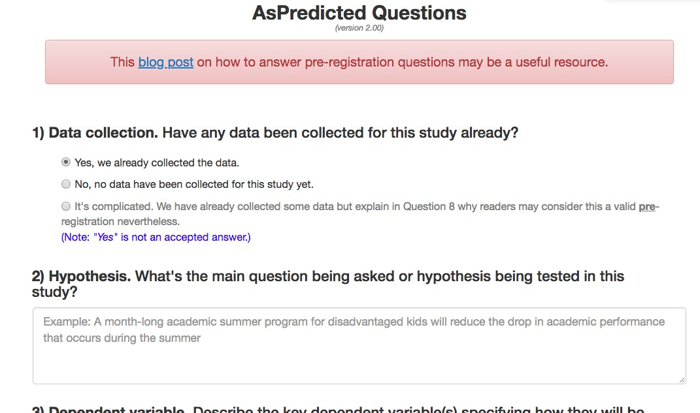

# Preregistration

## What is pre-registration?

## Why pre-register

- Nosek: "Don't fool yourself" ("...and you are the easiest to fool" -- R. Feynmann)
- Separate *confirmatory* from *exploratory* analyses
- Confirmatory (hypothesis-driven): *p*-hacking matters
- Exploratory: *p*-values hard(er) to interpret

## Types of pre-registrations

### Registered Reports

```{r}
knitr::include_graphics("https://cdn.cos.io/media/images/registered_reports.width-800.png")
```

<https://cos.io/rr/>

### Preregistered Analysis Plans

## How to pre-register

### Open Science Framework

- OSF: <http://help.osf.io/m/registrations/l/524205-register-your-project>

### AsPredicted.org


- [AsPredicted.org](https://aspredicted.org/)


```{r}
knitr::include_graphics("img/as-predicted-1.jpg")
```

```{r}

```

```{r}
knitr::include_graphics("img/as-predicted-3.jpg")
```

```{r}
knitr::include_graphics("img/as-predicted-4.jpg")
```

## Does it work?

- Susan Goldin-Meadow (skeptic), ["Why pregistration makes me nervous"](https://www.psychologicalscience.org/observer/why-preregistration-makes-me-nervous)
- Mike Frank (former skeptic, now advocate), ["Pregister everything"](http://babieslearninglanguage.blogspot.com/2016/07/preregister-everything.html)

- Preregistration can constrain the data analysis process, but...

>"To investigate whether,in psychology, preregistration lives up to that potential, we focused on all article spublished in Psychological Science with a preregisteredbadge between February 2015 and November 2017, and assessed the adherence to their corresponding preregistration plans. We observed deviations from the plan in all studies, and, more importantly, in all but one study, at least one of these deviations was not fully disclosed."

[Claesen et al., 2019](https://doi.org/10.31234/osf.io/d8wex)

---

Chambers, C., Munafò, M., & signatories, more than 80. (2013, June 5). Trust in science would be improved by study pre-registration. The Guardian. Retrieved from https://www.theguardian.com/science/blog/2013/jun/05/trust-in-science-study-pre-registration
Registered Reports. (n.d.). Retrieved January 24, 2017, from https://cos.io/rr/?_ga=1.163722943.1251838540.1458403228
Mathot, S. (2013, March 26). The pros and cons of pre-registration in fundamental research. Retrieved January 24, 2017 from http://www.cogsci.nl/blog/miscellaneous/215-the-pros-and-cons-of-pre-registration-in-fundamental-research
(Optional) Frank, M. (2016, July 22). Preregister everything. http://babieslearninglanguage.blogspot.com/2016/07/preregister-everything.html
(Optional) Claesen, A., Gomes, S. L. B. T., Tuerlinckx, F., & Vanpaemel, W. (2019, May). Preregistration: Comparing Dream to Reality. Retrieved from psyarxiv.com/d8wex.
