# Version control

## What is it?

## How does version control work

## Tools for version control

### On your local machine

#### Git

- A *distributed* software version control system
    - Code base distributed across multiple machines
- Developed by Linus Torvalds of Linux fame
- A database for keeping track of the history of changes in text files
- Open-source and platform/operating system agnostic
- A `repository` or `repo` is a collection of related text files
- A `commit` is a time/date-stamped 'version' of a set of text files.
    - Git keeps track of how versions differ.
    - Each version gets its own unique 'name', e.g., `85c5f7a`
- A `branch` is a part of a project, e.g., `main` or `testing_new_feature`.
    - Git keeps track of branch-specific histories.
- Can `merge` branches or `revert` to earlier versions.
- Like MS Word's track changes, but *not* automatically saved.
    - <span class="red">I repeat, not automatically saved!</span>
- Git tutorial: <https://www.w3schools.com/git/default.asp?remote=github>

### For collaboration

#### GitHub

- A commercial web service: <https://github.com>
- [Acquired by Microsoft in 2018](https://blogs.microsoft.com/blog/2018/10/26/microsoft-completes-github-acquisition/)
- Use Git on your local machine(s), but share code with other people via the web

#### GitLab

- GitHub not the only game in town
- <https://git.psu.edu>
- ROG wishes that PSU supported GitHub, too.
    - Why don't we? It's complicated.

## How and why could I use them?

### Questions to ponder

- Do I make and edit text files?
    - e.g., data files (your data are text files, no?)
    - R code, SPSS syntax, Python, MATLAB code
    - HTML, JavaScript, CSS, Markdown, etc.
- Do I (want to) share making and editing text files with other people?
- Do I want to keep track of the changes?
- Do I want to produce reproducible workflows and share them openly with other people?

### Use Case: Editing text on GitHub

- Visit the repo: <https://github.com/gilmore-lab/2021-11-17-github/>
- Click on the pencil icon to the upper right of the `README.md` file.
- Make a change, save it, and *commit* the change.

#### Standard workflow

0. Create account on GitHub
1. Go to your GitHub page or project/lab page
2. Create a new repository
3. `Clone` the repo to your local machine
4. Edit the local copy; save, and `commit`
5. `Push` the changed version back to GitHub

### Use Case: Data analysis

- I want to analyze some data and document my analysis workflow
- I want my workflow to be reproducible to me (and to others)
- I want to share my workflow with other people to be fully transparent
- I want to keep track of the history of my analyses

#### Summary of basic steps

1. In your browser, create a repo on GitHub
2. `Clone` the repo to your local machine
3. In RStudio, create a new project
3. Work in the project
4. Save, commit, push (and repeat)

#### Create a repo

```{r, out.width="900px"}
knitr::include_graphics("img/github-new-repo.png")
```

```{r}
knitr::include_graphics("img/github-create-new-repo.png")
```


```{r}
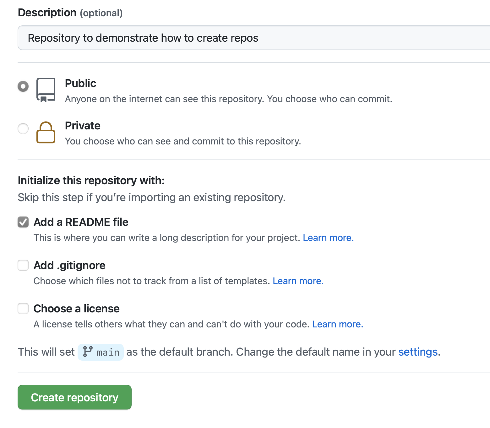
```

#### Clone' the repo

```{r}
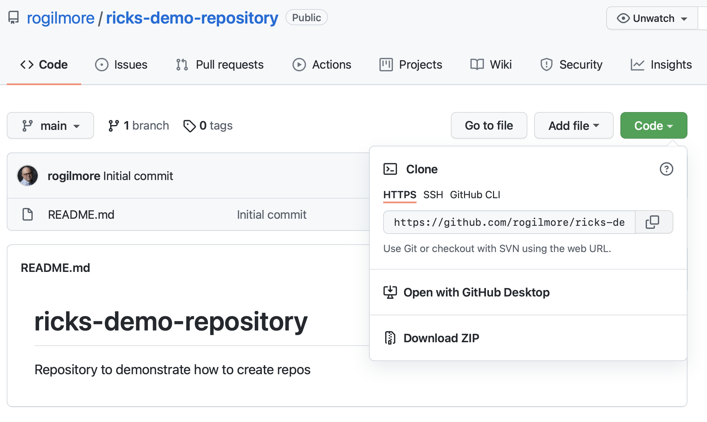
```

#### Create an RStudio project

```{r, out.width="500px"}
knitr::include_graphics("img/rstudio-new-project.png")
```

---

```{r, out.width="800px"}
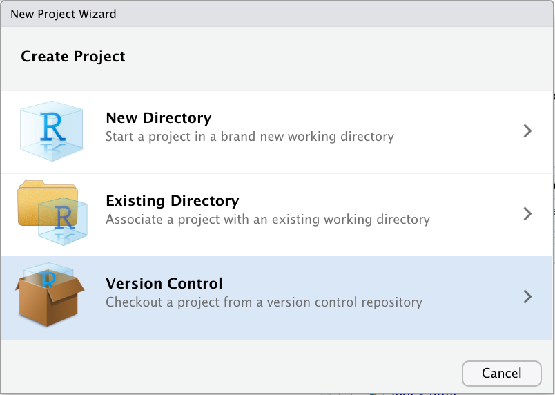
```

---

```{r, out.width="800px"}
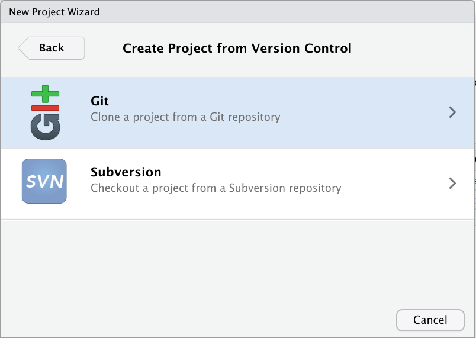
```

---

```{r, out.width="800px"}
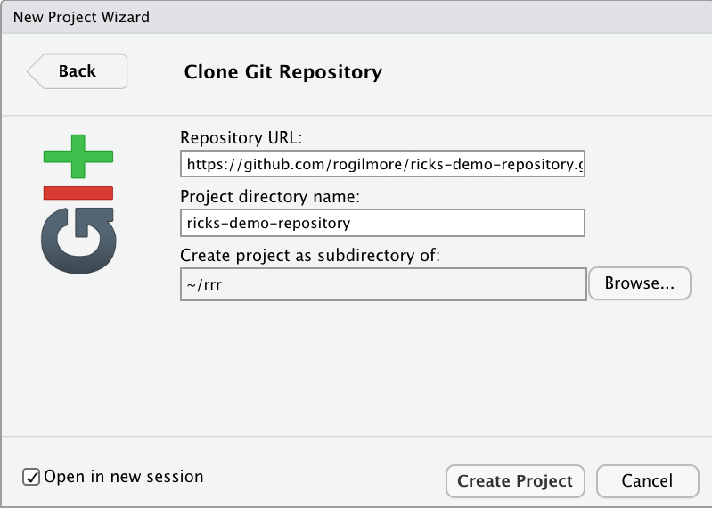
```

#### Make initial commit

```{r, out.width="800px"}
knitr::include_graphics("img/rstudio-git-tab-1.png")
```

---

```{r, out.width="800px"}
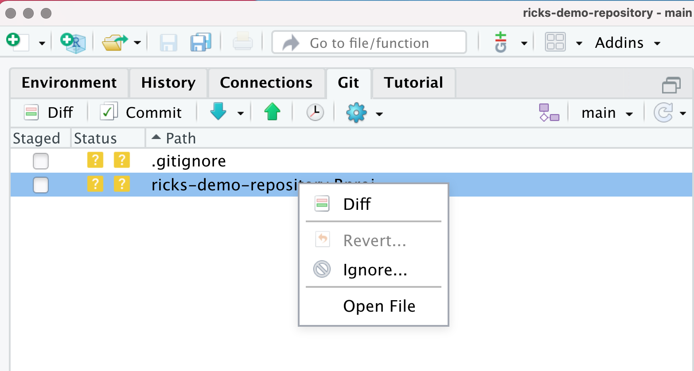
```

---

```{r, out.width="800px"}
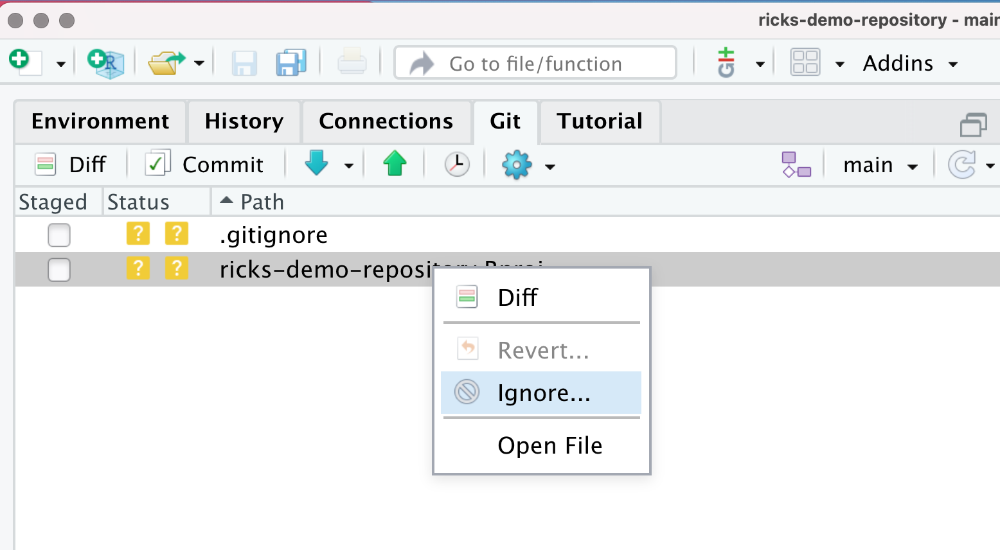
```

---

```{r, out.width="800px"}
knitr::include_graphics("img/rstudio-git-tab-4.png")
```

##### What is `.gitignore`?

- Tells git to ignore these files
- Ignore `*.Rproj` file--your settings are your own
- Ignore `.DS_store` files on Mac OS--your settings are your own
- Maybe ignore data files (to protect identities)--<span class="red">GitHub is public (unless you specify otherwise)</span>

---

```{r, out.width="800px"}
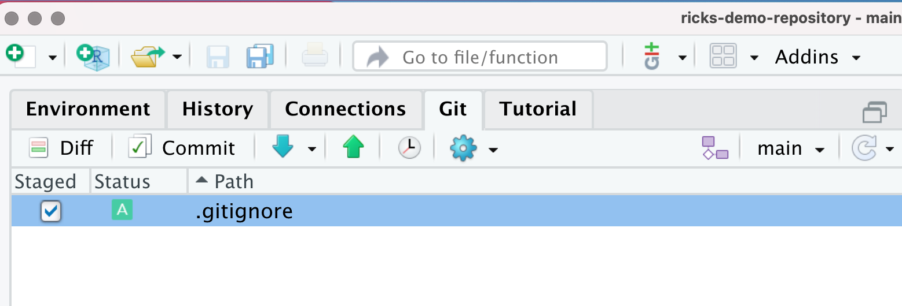
```

---

```{r, out.width="800px"}
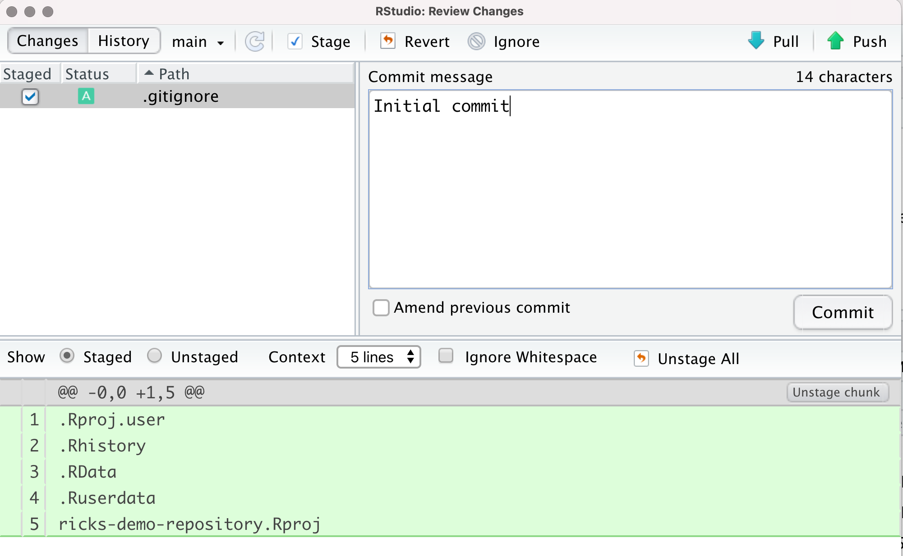
```

---

```{r, out.width="800px"}
knitr::include_graphics("img/rstudio-git-tab-7.png")
```

---

```{r, out.width="800px"}
knitr::include_graphics("img/rstudio-git-tab-8.png")
```

---

```{r, out.width="800px"}
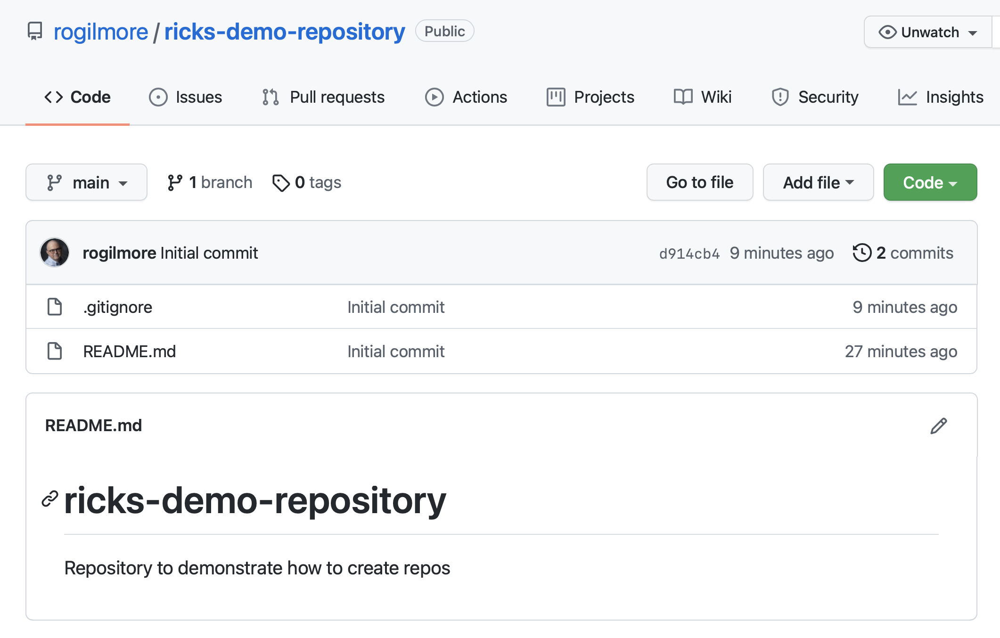
```

#### Pro tips

- Exclude your `.Rhistory` from version control.
- Exclude (and don't use!) the `.RData` file
  - Regenerate all internal data states anew
  - Avoid hidden dependencies in your code

---

```{r}
knitr::include_graphics("img/tools-project-options-general.png")
```

#### Edit the repo

```{r, out.width="800px"}
knitr::include_graphics("img/rstudio-new-rmarkdown.png")
```


```{r, out.width="800px"}
knitr::include_graphics("img/rstudio-new-analysis-1.png")
```

```{r, out.width="800px"}
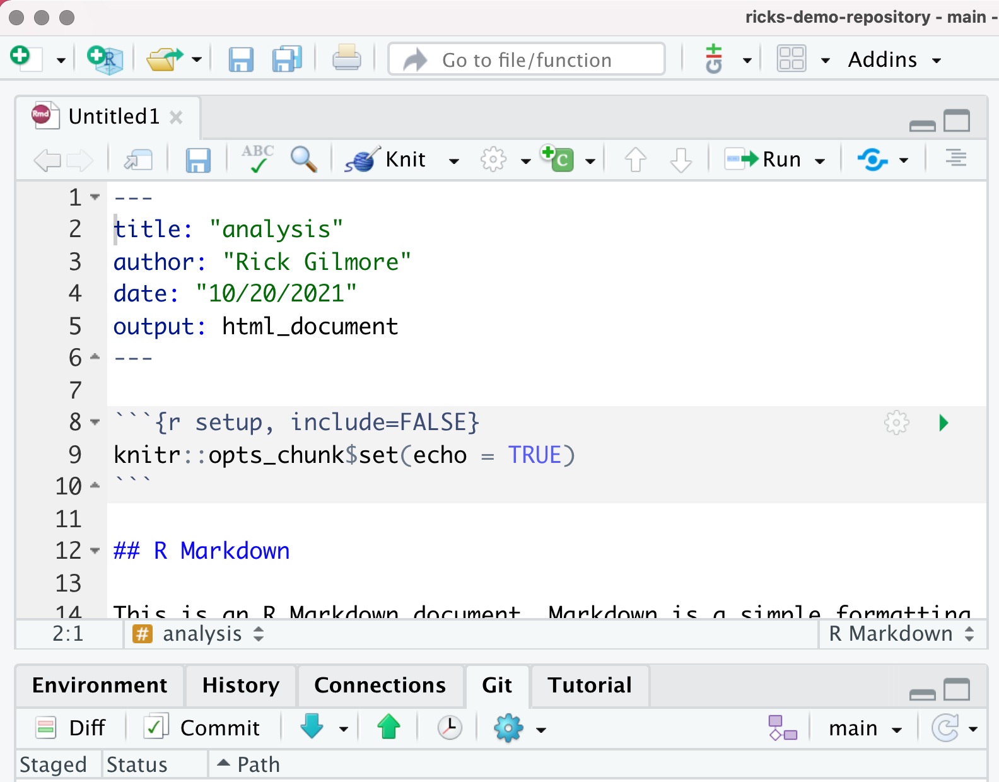
```
    
## Lessons learned

- It's hard to share a code base, data set, ...
- Tension between what works inside a team and what is transparent to others
- Tension between working quickly and making robust and clear code
- It's best to re-render your code to make sure it runs before quitting work.
- Be wary and especially careful with data about people
