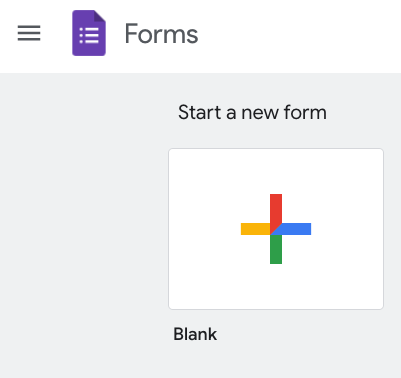

# Surveys

Most psychological scientists will need to ask people questions as part of their research.
This chapter describes how to use some tools that are specialized for creating surveys and collecting survey data.

## Google Forms

Google has create a tool to create and collect survey data called [Forms](https://forms.google.com).
It is often the easiest way to create a simple survey.

You must have a Google account to use forms.
The account can be one you have for personal use or one linked to your institution, if that institution has a contract with Google.

::: {.rmdnote}

Google Forms is extremely easy to use.
But keep in mind that Google is in the business of mining data and selling insights it derives from it.

You may want to consider carefully whether Google Forms is the best vehicle for your survey if you are collecting sensitive or identifiable data.

Google itself [suggests](https://www.termsfeed.com/blog/terms-conditions-google-forms/) that creating a Terms and Conditions document and deploying it with your form is a good practice to follow.

:::

### Creating a Google Forms survey

Let's create a Google Forms survey that we can later use to gather information from.

First, visit [forms.google.com](https://forms.google.com).
There are templates for many common types of use cases.
We're going to create a brand new survey, so we'll click on the large plus icon to create a blank survey.

```{r, fig.cap="Creating new Google Form at https://forms.google.com"}

```

### Testing a Google Forms survey

### Downloading survey results

### Cleaning and visualizing results

## SurveyMonkey

## Qualtrics

## KoBoToolbox

